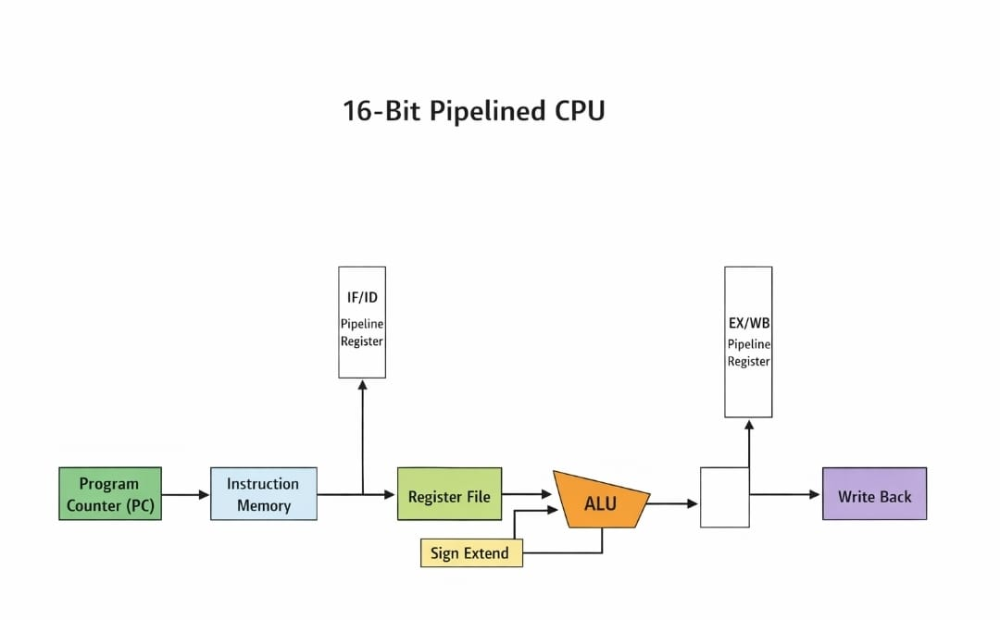
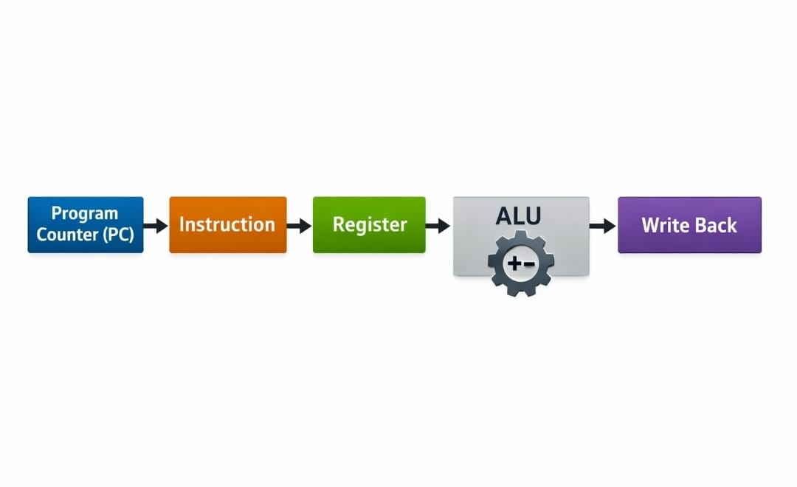

<h1 align="center">🚀 16-Bit Pipelined CPU in Verilog</h1>

A simple yet powerful CPU design demonstrating pipelined architecture and instruction-level parallelism.

📌 Overview

This project implements a 16-bit pipelined CPU using Verilog.
It performs arithmetic and logical operations such as ADD, SUB, AND, OR on 16-bit register data.

The design demonstrates instruction-level parallelism, where multiple instructions are executed simultaneously across different pipeline stages.

---

⚙️ Features

- 16-bit data processing
- Pipelined architecture
- ALU operations: ADD, SUB, AND, OR
- Modular design
- Verified using waveform simulation

---

🧠 CPU Architecture

🔹 Block Diagram

Explanation:

- Program Counter (PC): Generates instruction address
- Instruction Memory: Stores instructions
- Register File: Provides operands
- ALU: Executes operations
- Pipeline Registers: Transfer data between stages
- Write Back: Stores final result

---

🔹 Instruction Flow Diagram
!

PC → Instruction → Register → ALU → Write Back

Explanation:

- PC selects the instruction
- Instruction is fetched from memory
- Registers provide input data
- ALU performs the operation
- Result is written back

---

🎬 Project Demo

🔹 GTKWave Output

.png)

Shows:

- Program Counter progression
- Instruction flow through pipeline
- ALU outputs (0008, 0002, 0001, 0007)
- Write-back results

---

🔹 VS Code VCD Waveform

[VS Code Waveform](CPU(VS).png)

Shows:

- Signal transitions
- Correct pipeline execution
- Matching expected outputs

---

🚀 How to Run

iverilog -o cpu.out src/*.v tb/testbench.v
vvp cpu.out
gtkwave cpu16_pipeline.vcd

---

⚠️ Limitations

- No hazard detection
- No data forwarding
- No branch instructions

---

🚧 Future Improvements

- Hazard Detection Unit
- Data Forwarding
- Branching support
- Cache memory integration

---

🛠️ Tools Used

- Verilog
- Icarus Verilog
- GTKWave

---

👨‍💻 Author

Anubhav

---

📜 License

This project is licensed under the MIT License.